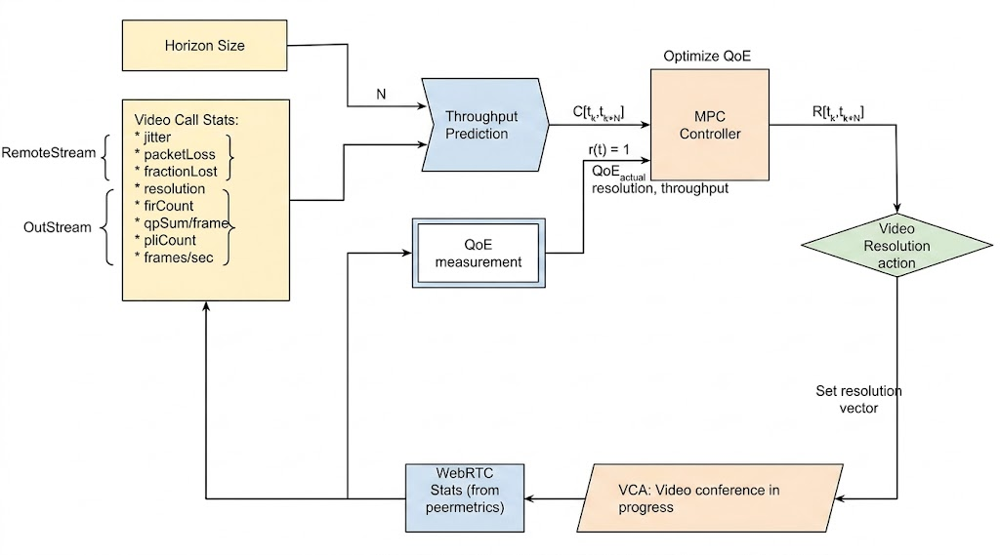

## JitterNot: ABR for VCAs with DNN and MPC

Video conferencing has become an essential part of everyday life worldwide. How a VCA varies video quality under different network conditions is pivotal in determining the user-perceived Quality of Experience (QoE). 

Adaptive Bitrate (ABR) algorithms are often used to optimize QoE during video conferencing. However, they use fixed control rules or heuristics and suffer from a key **limitation**: 
they do not take into account the deployment environment and network conditions. 

We use a Model Predictive Controller (MPC) in a closed loop and supply it with predicted throughput to effectively evaluate QoE parameters. 

##### Our Contributions
* **Throughput Prediction**: An Long Short-Term Memory (LSTM) model that simplifies the control system from Multi-Input Single-Output (MISO) to Single-Input Single-Output (SISO).
* **QoE Optimization**: An MPC controller that optimizes the perceived QoE by utilizing the Receding Horizon Control (RHC) principle to find the optimum value of video resolution ($R$).

We demonstrate that running the closed-loop control by JitterNot on top of the VCA can improve or match the default codec’s QoE during a video conference.

  

We list its 4 primary components - 

1.  **WebRTC stats:** Our VCA, Google Meet, uses webRTC, an open framework for the web that enables Real-Time Communications in the browser. The webRTC API allows capturing the mediaStream statistics including all the features we need. 
2.  **Throughput Prediction:** Uses an LSTM model to predict the throughput values (in packets/s) for the horizon size of 5 seconds
3.  **MPC Controller:** Includes 2 models for QoE estimate- frame jitter and frameRate, that utilize the predicted throughput. It solves the QoE optimization problem using a constraint solver.
4.  **Video Resolution Switching:** It receives the resolution values that optimize the QoE. And changes the resolution of the ongoing video call.

#### Core Findings vs. Google Meet Baseline
* **Predictive Accuracy:** The core LSTM look-ahead tracking model achieved a tight average Root Mean Square Error (RMSE) of **0.4** across test validation sets.
* **Resolution Maintenance:** Unlike rule-based heuristics, JitterNot's rolling horizon proactively anticipated traffic fluctuations, ensuring the calculated resolution profile matched or exceeded default WebRTC behaviors without degrading quality.
* **Metric Improvements:** Across 10 independent evaluation trials, JitterNot demonstrated substantial performance gains over standard Google Meet engine policies:

| Performance Metric | Average Gain vs. Default Google Meet Baseline |
| :--- | :--- |
| **Overall QoE Metric Score** | **+18.78%** |
| **Perceived Video Quality ($q(R)$)** | **+68.50%** |
| **Frame Jitter Suppression** | **-18.97%** (Lower Jitter) |
| **Quantization Parameter ($QP$)** | **+9.77%** (Slightly Higher Compression) |

 

Please read our [full report](/Documentation/jitternot_293N_ml_ns.pdf) for complete implementation details and findings.